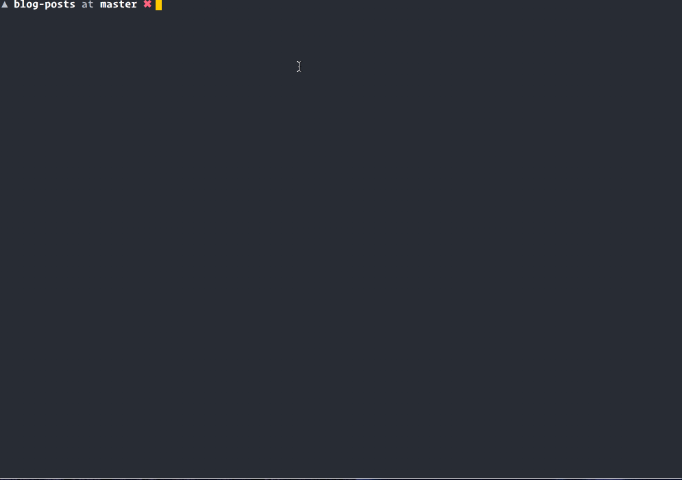

# Markdown To API 

I had a problem with jekyll and wanted to move to a more "front-end agnostic" solution. What this script does is takes all your markdown posts, parses the markdown and front-matter with [gray-matter](https://github.com/jonschlinkert/gray-matter), stores it into a json file with [node-json-db](https://www.npmjs.com/package/node-json-db) and serves it over an API with [json-server](https://github.com/typicode/json-server). 

## Usage Instructions 
~~_It's a little messy for now, I plan on turning it into a command line utility, but will need a little more time for that. At the moment, it's designed for Jeykll front matter, so it pulls in stuff like `date_published`, I'm going to modify it so that it just pulls all the front-matter_~~

To make it work with more than just jekyll, it now pulls all the front matter into a matter object, so to get the title, where you used to just get `title`, you would have to type `matter.title`, a small price to have to pay to get it to play nice with all types of markdown front-matter. 

- Copy all your .md files to this directory
- run `chmod +x migrate.sh` to give the script execution privs 
- `npm run migrate` will migrate your posts and serve them 

Additionally, if you don't want to remigrate your posts into the database, you can just run `npm run serve` to serve them. 

# UPDATE NOTES

This now works as a full on node app, rather than a compilation of bash scripts and node apps as before. 

~~It's also now packaged using [pkg](), so you can go to the [releases section]() and download the package from there, and just run `./....` without having to do the whole npm install thing. Huzzah!
~
~

So the package doesnt work yet, and theres no releases, but it does work as a node app. So if you type `node index.js [path to all your md files]`, it will compile them to db.jsonand serve your posts on localhost:3000. 

**INSERT GIF HERE** 

Unfortunately, this also means that there's no separate `migrate` and `serve` command, everytime you run it it just migrates and serves. If you don't want to serve it you can just `ctrl-c` and cancel the server, but I get that thats not really elegant so I'm working on something else.   

If you prefer the old way of doing things, go the [legacy branch] and get that one, it still works the way it used to! 
